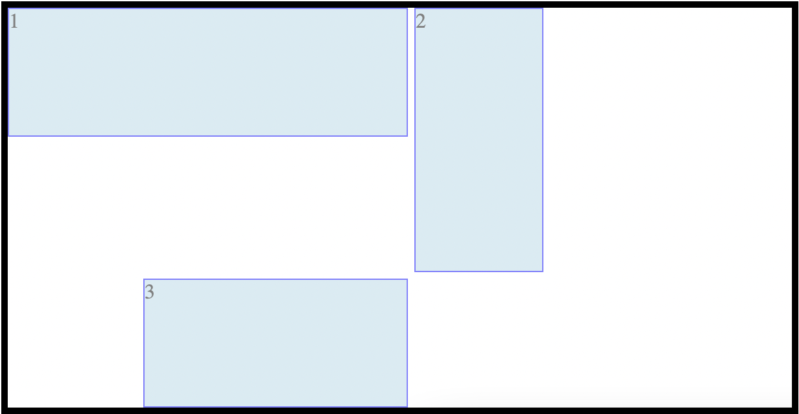
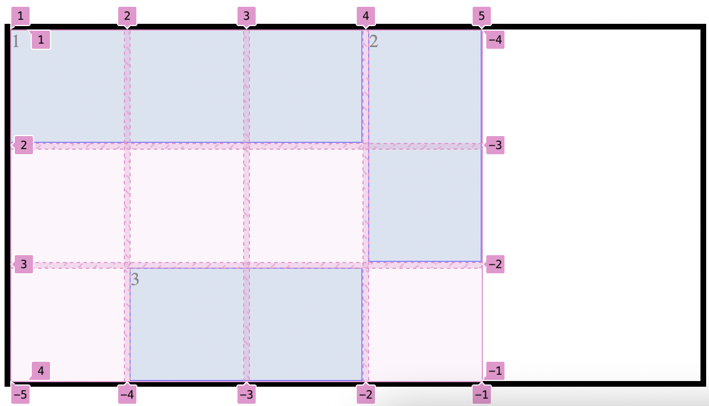
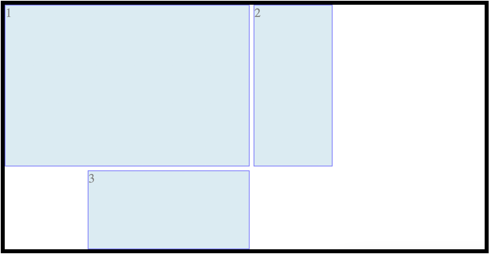

# Grid
Es un sistema de maketación bidireccional, que permite desarrollar interfaeses o layouts del estilo de tablas. Se compone de filas y columnas (con celdas). Se puedo anidar unos dentro de otros.

- Es un sistema para crear y organizar nuestrios layout.
- No es opuesto a flex ni a float.
- Se puede combinar entre flex y grid

## Implementación
HTML
```html
<body>
    <h1>Grid Layout</h1>

    <div class="GridContenedor">
        <div class="item item-1">
            1
        </div>
        <div class="item item-2">
            2
        </div>
        <div class="item item-3">
            3
        </div>
        <div class="item item-4">
            4
        </div>
        <div class="item item-5">
            5
        </div>
        
    </div>
</body>
```
CSS : Uso de reglas en el contenedor
```css
.GridContenedor{
    display:grid;

    grid-template-columns:100px 100px 100px ;/*La cantidad de medidas que ponga es la cantidad de colunas que creo*/
    grid-template-rows:100px 100px 100px ;/*La cantidad de medidas que ponga es la cantidad de filas que creo*/
}

```
CSS: Uso de reglas en los elementos 

```css
.item-1{
    grid-column-start:1;
    grid-column-end:4 ;
    grid-row-start:1 ;
    grid-row-end:3 ;
}
.item-2{
    grid-column-start: 4;
    grid-column-end: 5;
    grid-row-start: 3;
    grid-row-end: 1;
}
.item-3{
    grid-column-start: 2;
    grid-column-end: 4;
    grid-row-start: 3;
    grid-row-end: 4;
}
```
Como se deberia ver



Se pueden invertir el start y el end de los elementos y debe funcionar de la misma manera
```css
.item-1{
    grid-column-start:1;
    grid-column-end:-2;
    grid-row-start:1 ;
    grid-row-end:-3 ;
}
```
Ejemplo:



Poddemos utilizar la palabra "SPAN" para indicar cuantas columnas o filas queremos que ocupe un item.
EJ: Si quiero que un elemento se expanda 3 columnas, camos a realizar un span de 4.

```css
.item-1{
    grid-column-start:1;
    grid-column-end:span 3;/*Amplia mi caja cuantas columnas pongas*/
    grid-row-start:1 ;
    grid-row-end: span 2;/*Amplia mi caja cuantas filas pongas*/
}
```
Ejemplo:


### Para Simplificar
Podemos simplificar, con el SPAN el codigo para seleccionar la cantidad de elementos que queremos sin importar desde donde empieza, por que entiende desde donde debe ser.

```css
 .item-1{
            
}
.item-2{
    grid-column: span 3 ;
    grid-row: span 2;
}
.item-3{
    grid-column-start: 2;
    grid-column-end: 4;
    grid-row-start: 3;
    grid-row-end: 4;
}
```
Sintaxis para simplificar la descripcion
```css
 .item-1{
    grid-column: 1 / 2 ;
    grid-row: 1 / 2;       
}
.item-1{
    grid-area: 1 / 1 / 2 / 2;
    /* Con esta medida debe pensar que 1 Columna start / 1 fila start / 2 columna end / 2 fila end */
}
```
### Para simplificar el Contenedor
Para que no tengamos que agregar las medidas de cada fila o columna de manera manual, sino que tomen una medida especifica con la medida establecida 

```css
.GridContenedor{
    display:grid;

    grid-auto-flow:column;
    grid-auto-rows:150px;
    grid-auto-columns:200px;
}

```
Las Celdas en grid termplate pueden marcarce en PX, %, em, rem, pero hay un valor especial llamado FR (fractional unit). Este valor nos permite fraccionar el tamaño disponible.

EJ: si tenemos 3 columnas y definimos la primera sea del tamaño  de 1fr, la segunda 2fr, y la tercera 1 fr. Esto hara que la segunda columna ocupe el doble de espacio de las otras 2

```css
.GridContenedor{
    display:grid;
    grid-template-columns:1fr 2fr 1fr 50px
    /*Hay que sumar la cantidad de fracciones pues sobre el total se dividen las fracciones*/   
}
```

Existen la propiedad minmax() nos permite definir un tamaño minimo y maximo para las columnas y filas:
```css
.GridContenedor{
    display:grid;
    grid-template-columns:minmax(100px, 1fr) minmax(100px, 1fr)1fr;
       
}
```

Existe otra propiedad llamad *Repeat* nos permite repetir un número de veces un tamlo de columna o fila.

```css
.GridContenedor{
    display:grid;
    grid-template-columns:1fr 1fr 1fr 1fr 1fr;
    grid-template-columns:repeat(5, 1fr);/*Este es lo mismo que el de arriba*/
}
```

Podemos nombrr las celdas utilizando *grid-template-areas* y asignar un nombre  a cada celda vacia.
```css
.GridContenedor{
    display:grid;
    grid-template-columns:repeat(3, 1fr);
    grid-template-rows:repeat(3, 100px);
    grid-template-areas:
        "fila1 columna2 columna3"
        "fila2 columna2 columna3"
        "fila3 columna2 columna3";
}
```
y ademas a cada caja le podemos decir que espacio ocupar:
```css
    .item-1{
        grid-area:"header header header";
    }
    .item-2{
        grid-area:"body body body";
    }
    .item-3{
        grid-area:"footer footer footer";
    }
```

Podemos utilizar las reglas de *justify-item* y *aling-items* para alinear los elementos dentros de sus celdas. Sus opciones posibles son: start, end, center, stretch.
Por defecto estan en stretch
```css
.GridContenedor{
    display:grid;
    grid-template-columns:repeat(3, 1fr);
    grid-template-rows:repeat(3, 100px);
    justify-items:start;
    align-items:end;
}
```
Podemos decirle a un item especifico que se alinee de una manera diferente utilizando *justify-self* y *align-self*

```css
.item-1{
    justify-self:center;
    align-self:stretch;
}
```
Por último podremos alinear nuestro grid en base a su contendor utilizando *justify-content* y *align-content*. Sus opciones posibles son: start, end , center, space-around, space-between y space-evelyn

```css
.GridContenedor{
    display:grid;
    height:600px;
    grid-template-columns:repeat(3, 1fr);
    grid-template-rows:repeat(3, 100px);
    justify-content:center;
    align-content:center;
}
```


[LINK DE JUEGO para paracticar grid](https://cssgridgarden.com/#es)


