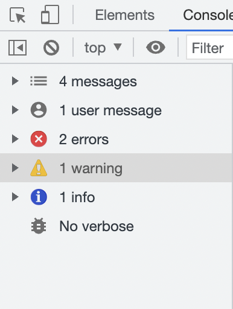

# JavaScript 2 Continuacion

## Más tipo de datos
- *undefined*: Valor que se asigna a una variable que no tiene valor (Se declara pero no se le asigno un valor)
- *null*: Valor que se le asigna a una variable, para indicar que no tiene valor intencionalmente.
- *NaN (not a number)*: Valor que obtenemos cuando se esperaba un número no lo es.
- *Empty* (Vacio): Un string con valor vacio ' ' o  " ".
- Funciones 
- Fechas  


```js
let noDefinido = undefined; //undefined
let noDefinido; // undefined

let varNula="texto";//(string)
varNula=null; //Null

let noEsNumero=NaN// NaN

let vacio = " "; // Este es Empty

let saludar = function(){
    console.log("hola a todos")
}// Esta es una funcion

let fecha = new Date();//EN realidad es un objeto

```
Podemos ver siempre que tipo de dato es una variable utilizando el operador:
`typeof`

```js
    console.log (typeof noDefinido);
    console.log (typeof varNula);
    console.log (typeof noEsNumero);
    console.log (typeof vacio);
    console.log (typeof saludar);
    console.log (typeof fecha);
```

## Consola (Chrome developer tools)

La consola nos permite imprimir mensajes y depurar  nuestro código. Podemos imprimir mensajes de diferentes tipos.

Tambien nos permite filtrar los mensajes segun su tipo


```js
//Mensajes informativos
console.log ("Este es un mensaje informativo");

//Mensaje de error
console.error("Este es un mensaje de error");

//Mensaje de Advertencia
console.warm("Este es un mensaje de Advertencia");

//Mensaje de información
console.info("Este es un mensaje informativo");

//Mensaje de depuracion (no verbose)
console.log ("Este es un mensaje informativo para depuración");

//Tabla de datos
console.table(["Manzana", "Pera", "uva"]);

```

## Operadores JS

Son simbolos que nos permiten hacer operaciones en JS. Hay distintos tipos; Aritmeticos, asignacion, comparación, logica, entre otros (Operaciones matematicas)

- Aritmeticos
Operaciones Matemáticas
    - Suma (+): Suma de valores
    - Resta (-): Resta de valores
    - Multiplica (*): Multiplica valores
    - Division (/): Divide valores
    - Módulo (%): Devuelve el restante de la división de valores 
        EJ: 4/2 = 2 , *0*
    - Incremento (++): Incrementa en 1 el valor de la variable
    - Decremento (--): Decrementa en 1 el valor de la variable

```js
    let a = 10;
    let b = 5;


    let suma = a + b; // 15
    let resta = a - b; // 5
    let multipli = a * b; // 50
    let division = a / b; // 2
    let modulo = a % b; // 0 
    let increment = a ++; // 11
    let decrement = b --; // 4

    modulo = resta = suma = increment = b - 5; //Todas las variables quedan valiendo 0 ya que tomaron el valor del calculo realizado entre b - 5 = 0.
```

Un ejemplo de modulo muy comun es para saber si un número es par o impar.

Si el restpo de la division es un número por 2 es igual a 0 es *PAR*
Si el restpo de la division es un número por 2 es igual a 1 es *IMPAR*

```js
    let numero = 10;
    let esPar= (numero%2 === 0)     // Es true
    let esImpar = (numero%2 !== 0)  // Es false
```

- Comparativos
Se utilizan para comparar valores en js
    - Igual `==`: Comparo si 2 valores son iguales
    - Estrictamente igual `===`: Compara si 2 Valores son iguales y del mismo tipo
    - Es distinto `!=`: Compara si dos valores son distintos
    - Es distinto estricto `!==`: Compara si 2 Valores son distintos de valor y tipo
    - Mayor que `>`: Compara si un valor es mayor a otro
    - Mayor que `<`: Compara si un valor es menor a otro
    - Mayor que `>=`: Compara si un valor es mayor o igual a otro
    - Mayor que `<=`: Compara si un valor es menor o igual a otro

    ```js
    let a = 10;
    let b = "10";

    let esIgual = (a == b); //false
    let esEstrictamenteIgual = (a === b); //true
    let esDistinto = (a != b); //false
    let esEstrictamenteDistinto = (a !== b); //true

    let num1 = 10;
    let num2 = 5;


    let mayorque =(num1 > num2);//true
    let menorque =(num1 < num2);//false

    let mayorIgualQue =(num1 >= num2);//true
    let menorIgualQue =(num1 <= num2);//false
    ```

- Funciones 
Es un bloque de código o algoritmo que realiza una operación especifica. Puede recibir valores de entrada y devolver un único resultado.

```js
function saludar(nombre, edad){
    //Código que va a realizar mi funcion , rodeado entre { }
    console.log("Hola a todos!!, mi nombre es " + nombre);
    console.log("Mi edad es " + edad);
}

//recive la variable "nombre" y la puede usar entre parentesis
//Llama a la funcion
saludar("Juan", 18 );
saludar("Sebastain" , 30);  
```