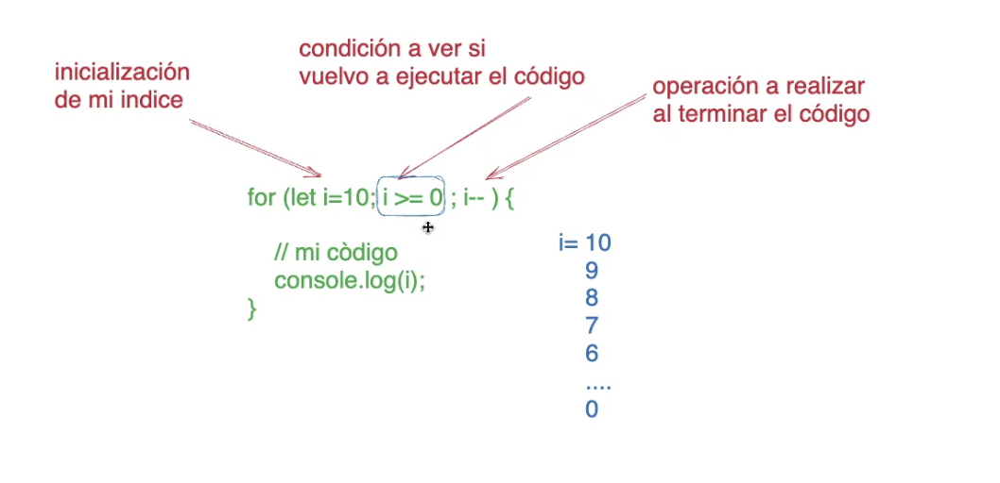

- Funciones 
Es un bloque de código o algoritmo que realiza una operación especifica. Puede recibir valores de entrada `Parámetros` y devolver un único resultado. Los valores que se pasan a la función cuando se invoca, se llaman `argumentos`. Tenemos la opción de inicializar un parametro con un valor. Recordemos dejar estos parametros "Inicializados" al final de la la lista.

```js
/**
 *Función que saluda al usuario y le indica su nombre y edad 
 * @param {String} nombre - Es el nombre del usuario
 * @param {number} edad - Es la edad del usuario
 * 
 * @return {void} - No devuelve nada
 **/

function Saludar(nombre, edad, genero="No indicado"){
    //Código que va a realizar mi funcion , rodeado entre { }
    let respuesta; // 1. crer variable
    respuesta = ("Hola a todos!!, mi nombre es " + nombre + "y mi edad es " + edad); //2. actualizo la informacion de mi variable

    return respuesta;//3. Devuelvo la viable actualizada
}

//Llama a la funcion, multiples veces
let mensaje;
mensaje = Saludar("Juan", 18 );
console.log(mensaje);
alert(mensaje);

mensaje = Saludar("Maria", 33 );
mensaje = Saludar("Sebastian", 25 );
mensaje = Saludar("Tomas", 40 );


/*-----------EJEMPLO GRAFICO -  No tiene que ver con lo anterior--------------*/
let proponas = 0;//creo la variable global propinas

function Camarero(cosa){
    propinas++;
    llevar esta *cosa* a la cocina;
    llevar esta *cosa* a el *lugar*;
    console.log(propinas);
}

Camarero("plato");//La respuesta de esto es que el camarero lleva el plato a la cocina 
Camarero("plato", "Basura")//La respuesta de esto es el camarero lleva el plato a la Basura.
//la opcion propinas++; incrementaria cada vez que se utiliza la funcion camarero.
```


- Condicionales
Son estructuras de control que nos permiten tomar decisiones. Si se cumple la condición, se ejecuta un bloque de código, y si no se cumple, se ejecuta otro bloque de código.
    - El uso de `else` es opciona. Va en caso de que quiera que el sistema haga algo en caso de no se cumpla la condición.
    - Tambien se pueden anidar condiciones `if` dentro de otro `if`

```js
/**
 * EJ 1: Me indica si el el modulo (resto de una division) de 2 de un numero es par o impar 
 **/
let numero = 7;
if(numero % 2 == 0){
    console.log("El número es PAR");
}else{
    console.log("El número es IMPAR");
}

/**
 * EJ 2: Me indica si es mayor de edad 
 **/
let edad = 16;

if(edad >= 18){
    console.log("El número es PAR");
}else{
    console.log("El número es IMPAR");
}
/**
 * EJ 3: Anidar if dentro de otro
 **/
let edad = 16;

if(edad > 18){
    if (edad >100){
        //el numero esta entre 25 y 100
    }
    else{
        //el numero es menor a 100
    }
}else{
    console.log(" ");
}

```
## Uso de Bucles
Los Bucles permiten repetir código varias veces. En JS tenemos 3 tipos de Bubles:
    - `for`: Se utiliza cuando sabemos cuantas veces queremos que se repita
    - `while`: Se utiliza cuando no sabemos cuantas veces se va a repetir ek bloque de código.
    - `do-while`: Es igual al `while` pero se ejecuta al menos una vez.

```js
//FOR
for(let contador=0; contador < 10; contador++){
    Console.log("Hola Alumnos!!!" + contador);
}
//While
let i =0;
while(i < 10){
    console.log ("Hola Alumnos");
    i++;

    //i va a ser al azar
}
let salir =false;
while(salir == false){
    console.log ("Me quedo jugando");
   
    salir = true;
}

// do-While
// Se ejecuta almenos una vez
let i = 0;
do {
    console.log("Hola Alumnos");
}while(i<5);
```



### Ejercicio de practica
1. Crear una función que reciba un número y devuelva si es `par` o `impar`.
2. Crear una función que reciba un número y devuelva si es `positivo` o `negativo` o `cero`.
3. Crear una función que me indique si es `mayor` o `menor` de edad.
4. Crear un función a la que si le indico el día de la semana me devuelve si es laboral o no.
5. Crear un función donde sus parametros sean jugador1 y jugador2 y vuelve si el jugador1 le gana a el jugador2 en un juego de `piedra` `papel` o `tijera`.
6. Modificar la calculadora del dia 25 para que podamos Sumar, restar, multiplicar o dividir 2 valores utilizando funciones.

